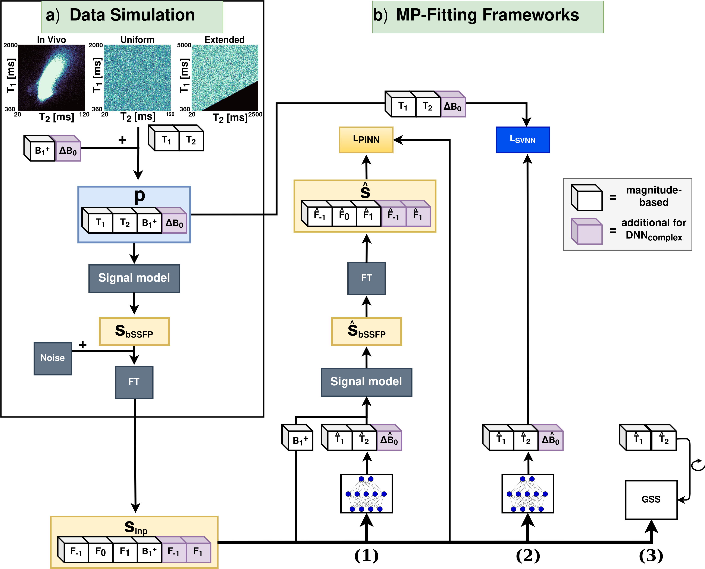

# FastRelax-DL
This is the repository for our publication **Flexible and Cost-Effective Deep Learning for Accelerated Multi-Parametric Relaxometry using Phase-Cycled bSSFP**. Our main goal is to provide a simple and effective framework to train lightweight deep neural networks (DNNs) for fast multi-parametric mapping. 
- **Interested to optimize for a broader or more confined parameter range?** Simulate your parameter range or distribution of choice, train the DNNs (a few second per epoch) and use the DNNs for multi-parametric relaxometry mapping. 
- **Acquiring data at other field strenghts?** Adjust the simulation to your needs of sequence parameters: TR, TE, nominal flip angle, or number of phase cycles.
- Play around with supervised and physics-informed (model-based) DNNs, DNN training parameters, and see the effects of complex-based vs. magnitude-based DNNs.


The workflow proposed in this work (purple cubes represent the extended input and output in case of complex-based DNNs).

# Summary 

This repository contains all necessary code to create the deep neural network (DNN) in silico training data, train the DNNs using PyTorch, and generate the code-based versions of the figures of the paper. The repository is structured as follows:

- Simulate the in silico training data using `scripts/in_silico_create_training_data.py` 
    - The respective configs file for the in silico distribution can be found in `cfgs/0.simulation/cfg_*.yml`
- Train the DNNs based on in silico data using `scripts/train_in_silico.py`
    - The respective config file for the training can be found in `cfgs/1.nn_train/train_in_silico.yml`
- Generate the figures of the paper using `scripts/figure*.py`
    - Generated Figures are based on code and might not exactly match the figures in the paper
- The trained models from the paper can be found in `models/`
    - `magnitude-based/trained-snr`: All DNN modesl trained with different SNRs
    - `magnitude-based`: The magnitude-based DNNs trained in the second iteration
    - `complex-based`: The complex-based DNNs used for Figure 5, 6, and 7
    - `fastrelax`: Starting a new training will save the new model weights here
    - `fig8`: Contains all models weights for each epoch to create Figure 8
- The scripts to process raw in vivo data are not shared but already prepared in vivo test data for DNNs can be requested.

# Paper
[Flexible and Cost-Effective Deep Learning for Accelerated Multi-Parametric Relaxometry using Phase-Cycled bSSFP](https://link.springer.com/article/10.1038/s41598-025-88579-z?utm_source=rct_congratemailt&utm_medium=email&utm_campaign=oa_20250209&utm_content=10.1038%2Fs41598-025-88579-z).

```
@article{birk_flexible_2025,
	title = {Flexible and cost-effective deep learning for accelerated multi-parametric relaxometry using phase-cycled {bSSFP}},
	volume = {15},
	issn = {2045-2322},
	url = {https://doi.org/10.1038/s41598-025-88579-z},
	doi = {10.1038/s41598-025-88579-z},
	number = {1},
	journal = {Scientific Reports},
	author = {Birk, Florian and Mahler, Lucas and Steiglechner, Julius and Wang, Qi and Scheffler, Klaus and Heule, Rahel},
	month = feb,
	year = {2025},
	pages = {4825},
}
```

# Installation
The conda environment (FastRelax-DL) used in this work can be installed using:
```bash
conda env create -f env.yml
```
miniforge is recommended for installation (using only the conda-forge channel)


# Data 
Please note that in silico and in vivo data to reproduce all Figures can be requested from the authors upon reasonable request. Please contact florian.birk@tuebingen.mpg.de

In case you downloaded the data copy the `in_silico` and `in_vivo` folders to the `path/to/project/FastRelax-DL/data` folder. The data folder should look like this:
- `in_silico/`
    - `mc`: Results from in silico MC simulations
    - `pred`: Results from the DNN predictions of Figure 5
    - `test`: Test data for the DNNs
    - `train`: Training data for the DNNs
- `in_vivo/`
    - `density_map`: Density maps to create the density distributions plots of Figure 1
    - `metrics`: Metrics calculated for each epoch of Figure 8
    - `pred`: Results from the DNN predictions of Figure 6 and 7
    - `test`: Preprocessed and prepared PyTorch input datasets for the DNNs, a converted version in nifti format, and the Masks used for the Figures. 


# Licensing
This repository is licensed under the MIT License. For more information, please see the LICENSE file.

`Note: The paper associated with this repository is licensed under a separate license, Creative Commons Attribution 4.0 (CC BY 4.0). If you are using or referencing the paper, please ensure you comply with the terms of the CC BY 4.0 license.`